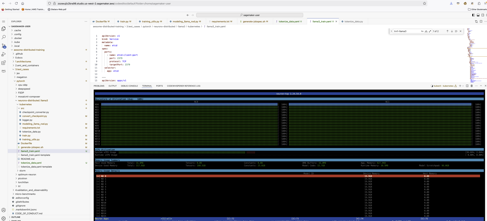
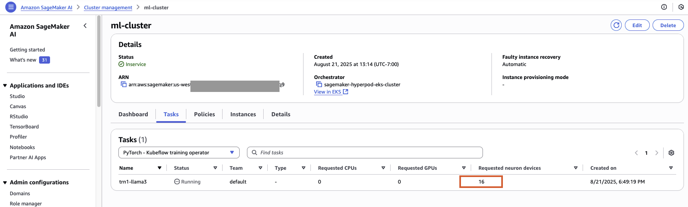

# Build on Trainium Start Guide Using SageMaker Hyperpod

In this tutorial, we will use Neuronx-Distributed (NxD) library to train llama3 model like [this workshop](https://catalog.workshops.aws/sagemaker-hyperpod-eks/en-US/03-trainium-nxd)

If you want to use SageMaker AI Studio space to run this workshop, and it is a new account or account without VPC, SageMaker domain yet, follow [the CloudFormation deployment here](https://catalog.workshops.aws/sagemaker-hyperpod-eks/en-US/00-setup/env-setup/01-env-sm-code-editorThe) to create the SageMaker AI domain and VC code editor space. The SageMaker Domain is created in the default VPC. Once deployed, open SageMaker AI studio, run the Code Editor default space.

### Step 1 Build the Container

Similar to [this workshop](https://catalog.workshops.aws/sagemaker-hyperpod-eks/en-US/03-trainium-nxd/01-setup), we need first build the container image to run the training job, using the latest Neuron SDK base container:

```bash
region=us-east-2
dlc_account_id=763104351884
aws ecr get-login-password --region $region | docker login --username AWS --password-stdin $dlc_account_id.dkr.ecr.$region.amazonaws.com

docker pull 763104351884.dkr.ecr.us-east-2.amazonaws.com/pytorch-training-neuronx:2.7.0-neuronx-py310-sdk2.24.1-ubuntu22.04
```

clone the repo and go to the folder:
```bash
cd ~
git clone https://github.com/aws-neuron/neuron-workshops
cd neuron-workshops/labs/Hyperpod
```

We will build docker image using the Dockerfile in this directory.
```bash
export AWS_REGION=$(aws ec2 describe-availability-zones --output text --query 'AvailabilityZones[0].[RegionName]')
export ACCOUNT=$(aws sts get-caller-identity --query Account --output text)
export REGISTRY=${ACCOUNT}.dkr.ecr.${AWS_REGION}.amazonaws.com/
export IMAGE=llama3_trn
export TAG=:latest
docker build $DOCKER_NETWORK -t ${REGISTRY}${IMAGE}${TAG} .
```

Then push the image to the ECR private registry
```bash
# Create registry if needed
export REGISTRY_COUNT=$(aws ecr describe-repositories | grep \"${IMAGE}\" | wc -l)
if [ "${REGISTRY_COUNT//[!0-9]/}" == "0" ]; then
    echo "Creating repository ${REGISTRY}${IMAGE} ..."
    aws ecr create-repository --repository-name ${IMAGE}
else
    echo "Repository ${REGISTRY}${IMAGE} already exists"
fi

# Login to registry
echo "Logging in to $REGISTRY ..."
aws ecr get-login-password | docker login --username AWS --password-stdin $REGISTRY

# Push image to registry
docker image push ${REGISTRY}${IMAGE}${TAG}
```

### Step 2 Create Hyperpod Cluster  
You can use [the CloudFormation deployment here](https://catalog.workshops.aws/sagemaker-hyperpod-eks/en-US/00-setup/00-workshop-infra-cfn) to create the Hyperpod cluster with EKS.

Here are the parameters to change to use ml.trn1.32xlarge instance in us-west-2:
1. Set AvailabilityZoneId to usw2-az4 to better get on-demand instance
2. Set UsingSMCodeEditor to True if you want to access the cluster from VS code editor in SageMaker AI domain.
3. Set AcceleratedInstanceType to ml.trn1.32xlarge
4. Set kubernetes version to 1.32

Once CFN deployment finished successfully, you can manually verify the VPC, subnet, and SG are same as CFN deployment output, and you can execute the [same commands in this workshop](https://catalog.workshops.aws/sagemaker-hyperpod-eks/en-US/00-setup/00-workshop-infra-cfn#environment-variables) to setup environment variables.

You will also need to set up an FSx for Lustre File System through [Dynamic Provisioning in this workshop](https://catalog.workshops.aws/sagemaker-hyperpod-eks/en-US/01-cluster/06-fsx-for-lustre). It is noteworthy the namespace of this PVC is default, and your training job pod will need to be in the same namespace.


### Step 3 Start Training Job

Let us launches a training job to train 8B Llama 3.1 model. First, update the HF_ACCESS_TOKEN in generate-jobspec.sh file. Then execute it:
```bash
./generate-jobspec.sh
```
the script creates 2 yaml files tokenize_data.yaml and llama3_train.yaml. 

Next download the dataset and tokenize it from Hugginface Hub using tokenize_data.yaml job. The job stores the dataset in Fsx Lustre for training the model next.

```bash
kubectl apply -f ./tokenize_data.yaml
```

To list all of pods in different namespaces:
```bash
kubectl get pods --all-namespaces
```

The tokenize-data pod should run in default namespace. To describe the pod:
```bash
kubectl describe pod tokenize-data 
```

To check logs:
```bash
kubectl logs -f tokenize-data 
```

Once the tokenize-data pod is complete, you can use the train_llama3.yaml job spec file to train llama 3.1 8B model with the tokenized data from previous step.

```bash
kubectl apply -f ./llama3_train.yaml
```

You should be able to see two pods (etcd and trn1-llama3-worker-0) are running. Similarly, to check logs:
```bash
kubectl logs -f trn1-llama3-worker-0
```

If the pod is not in running state, you can delete it:
```bash
kubectl delete -f ./llama3_train.yaml
```

Once job start running successfully, you can run command line inside the container:
```bash
kubectl exec -it trn1-llama3-worker-0 —- neuron-top
```

You may see something similar to this:


Ctrl+C to exit the visualization.

You can check the running job status on Hyperpod Task Governance as well:


To cleanup, you can delete all of the pods:
```bash
kubectl delete -f ./llama3_train.yaml
kubectl delete -f ./tokenize_data.yaml
```